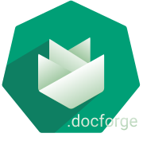

# docforge



[](https://reuse.software/)

Docforge is a *Documentation-As-Code* enabling command-line tool that reproducibly *forges* source documentation into publishable documentation bundles, using desired documentation state declarations called *documentation manifests*. A documentation manifest includes structured references to source documentation files and rules for fetching sources. All links within the Markdown documents are adjusted automatically according to declared structure. Embeddable resources, like images, are download and packed into the bundles.

Docforge is not limited to, but is particularly well suited to using GitHub as distributed storage and version control system for source documentation. It was designed to solve the outstanding issue for multi-repo projects that want to maintain documentation in a distributed manner and yet release aggregated, coherent bundles out of it with minimal effort. 

Docforge is designed to support the re-purposing of documentation sources. Instead of designing documentation structures for a particular tool or platform, a single one is sufficient to produce multiple documentation bundles from it, each described in its own manifest, and targeting a particular publishing channel or purpose. The tool goes even further supporting the creation of completely new documents from existing sources by aggregations.

Docforge manifests are modular, supporting references to other manifests that are included recursively for maintaining potentially complex structures, e.g. for large documentation portals.


<figcaption>Figure 1: Docforge overview</figcaption>

From Documentation-as-Code tool chain perspective, Docforge is the tool that makes source documentation available for further transformation, processing and publishing. 

Figure 2 shows one of many options to build a Documentation-as-Code automated process, orchestrated by CI/CD, focusing on the role of Docforge. In this particular example, source documentation resides in multiple repositories and needs to be built as a static HTML website with HUGO, and then pushed to a repository configured to be served by GitHub Pages. When a new release is triggered, Docforge will use the released version of the documentation manifest dedicated to publishing with GitHub Pages to forge a bundle for this release. The bundle will then be used as input content by the next tool in the build process - HUGO.


<figcaption>Figure 2: Sample documentation-as-code tool chain, including Docforge as step 1 in the documentation build process</figcaption>

At a glance:
- Declarative
- Document selection rules support
- Composable manifests that can include references to other manifests recursively
- Designed to forge from distributed, remote documentation sources
- Abstracts source documentation to re-purpose it into documentation bundles targeting various platforms and tools
- Efficient operation
- out-of-the-box, optional support for HUGO
- out-of-the-box, support for GitHub and GitHub Enterprise

## Installation

### Users

Go to project [releases](https://github.com/gardener/docforge/releases), select the [latest release](https://github.com/gardener/docforge/releases/latest) and pickup a download for your OS:

- **Mac**: docforge-darwin-amd64
- **Linux**: docforge-linux-amd64
- **Windows**: docforge-windows-386.exe

> **Disclaimer on releases**: Until there is a stable 1.0 version changes are likely to occur and not necessarily backwards compatible. New features are released with a minor version increase. We do not release hotfixes except for the latest minor release, only for bugs and only when critical.

For convenience, copy the docforge executable somewhere on your PATH. For Linux/Mac `/usr/local/bin` is usually a good spot.

### Operators

Docker images with all docforge releases are public at [Google Cloud Registry](https://console.cloud.google.com/gcr/images/gardener-project/EU/docforge?project=gardener-project&gcrImageListsize=30). To pull a docforge image for a release use the release as image tag, e.g. for docforge version [`v0.30.0`](https://github.com/gardener/docforge/releases/tag/v0.30.0):
```sh
docker pull eu.gcr.io/gardener-project/docforge:v0.30.0
```

### Developers

``` sh
go get github.com/gardener/docforge
```

## Usage

> **GitHub API Disclaimer**: The docforge tool can pull material from GitHub and it will use the GitHub API for that. The API has certain usage [rt limits](https://docs.github.com/en/free-pro-team@latest/rest/overview/resources-in-the-rest-api#rt-limiting) and they are very easy to hit for unauthenticated requests - up to 60 requests per hour per originating IP as of the time of this writing. It is highly recommended to create a GitHub personal token ([GitHub Account > Settings > Developer Settings > Personal access tokens](https://github.com/settings/tokens)) and supply it to `docforge` with the `--github-oauth-token-map` flag.


### Basics

- **Getting help**
   ```sh
   docforge -h
   ```
- **Getting docforge version**
   ```sh
   docforge version
   ```

### Forge a build

To create a documentation material bundle, it is necessary to describe it in a manifest file. Example manifests can be found in the [example](example) directory of this project. For more information on creating manifests, see the [User guide](TODO).

Assuming that:
- the **destination** where the forged bundle will appear is `/tmp/docforge-docs`, and 
- the **manifest** file is [example/simple/00.yaml](example/simple/00.yaml), and
- the **GitHub token map** Comma separated strings in format \<host\>=\<user\>:\<token\> 
the command to forge the bundle is:
```sh
docforge -d /tmp/docforge-docs -f example/simple/00.yaml --github-oauth-token-map  github.com=<user>:<token>,...
```

All avaliable flags for the build command can be seen [here](docs/cmd-ref/docforge.md)

 ## What's next
- [User Documentation](docs/user-index.md)
